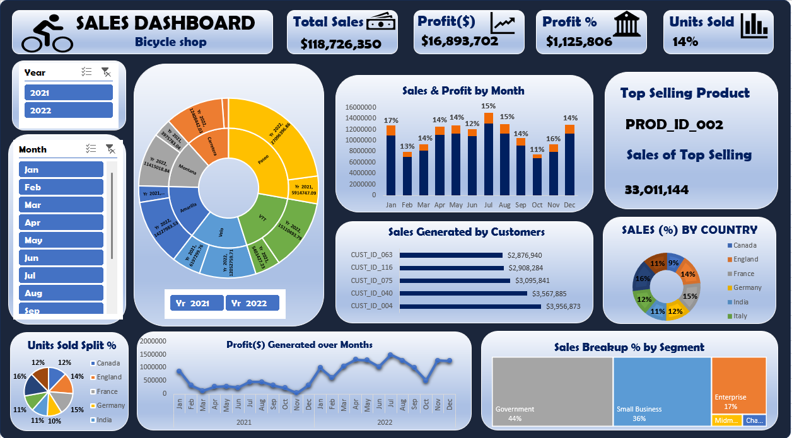

## 🚴 Bicycle Shop Sales Dashboard

### 📜 Project Overview

The **Sales Dashboard for a Bicycle Shop** is an interactive and visually compelling Power BI solution designed to track and analyze sales, profit, and customer engagement across different regions and segments. This dashboard empowers the bicycle shop's management to make data-driven decisions to optimize sales and customer satisfaction.

### ✨ Objective

The primary goals of this project are:

- To monitor sales performance and profitability over time.
- To identify top-selling products and customer segments.
- To analyze sales by region and customer demographics for targeted marketing.
- To provide actionable insights into monthly and yearly sales trends.

### 🔍 Key Insights and Features

#### 1. **Sales and Profit Overview**
   - **Total Sales:** $118,726,350  
   - **Total Profit:** $16,893,702  
   - **Profit %:** $1,125,806  
   - **Units Sold:** 14%

#### 2. **Top Selling Product**
   - **Product ID:** PROD_ID_002  
   - **Total Sales:** 33,011,144  

#### 3. **Sales Performance by Month**
   - Sales and profit percentage displayed in a bar chart for each month.
   - July and December were peak months with 15% and 14% of total sales, respectively.

#### 4. **Sales Generated by Customers**
   - **Top Customers:**
     - `CUST_ID_063`: $2,876,940
     - `CUST_ID_116`: $2,908,284
     - `CUST_ID_075`: $3,095,841
     - `CUST_ID_040`: $3,567,885
     - `CUST_ID_004`: $3,956,873

#### 5. **Sales Breakdown by Region**
   - Sales by country (% share):
     - **Canada:** 16%
     - **England:** 12%
     - **France:** 11%
     - **Germany:** 15%
     - **India:** 12%
     - **Italy:** 9%

#### 6. **Sales by Customer Segments**
   - Breakdown of sales by segments:
     - **Government:** 44%
     - **Small Business:** 36%
     - **Enterprise:** 17%
     - **Midmarket:** 3%

### 🛠️ Tools and Technologies Used
- **Power BI**: For interactive dashboard creation and data visualization.
- **Excel**: For data preprocessing and cleaning.
- **DAX (Data Analysis Expressions)**: For advanced calculations and measures.
- **SQL**: For querying and managing data.

### 📈 Project Learnings

This project showcases:

- The ability to visualize and analyze large datasets effectively.
- Insights into customer segmentation and regional sales performance.
- Monthly profit trends to identify seasonal sales patterns.
- Data-driven decision-making for product inventory and customer targeting.

### 📂 How to Use the Dashboard

1. **Clone the Repository:**
   ```bash
   git clone https://github.com/your-username/bicycle-shop-sales-dashboard.git
   ```
2. **Open in Power BI Desktop:**
   - Load the `.pbix` file in Power BI Desktop.
   - Connect to your data source if required.

3. **Interact with the Dashboard:**
   - Use the slicers to filter by year, month, and product category.
   - Drill down into customer-specific data for detailed insights.

### 🌟 Dashboard Preview



### 🌟 Why This Project Matters

This dashboard provides:

- A comprehensive view of sales performance across different regions and segments.
- Actionable insights for improving product strategy and customer engagement.
- A foundation for expanding into new markets with data-driven decisions.
- 
### ⭐ Feedback

If you find this project valuable, please ⭐ star this repository and share your feedback. Suggestions for improvement are always welcome!
